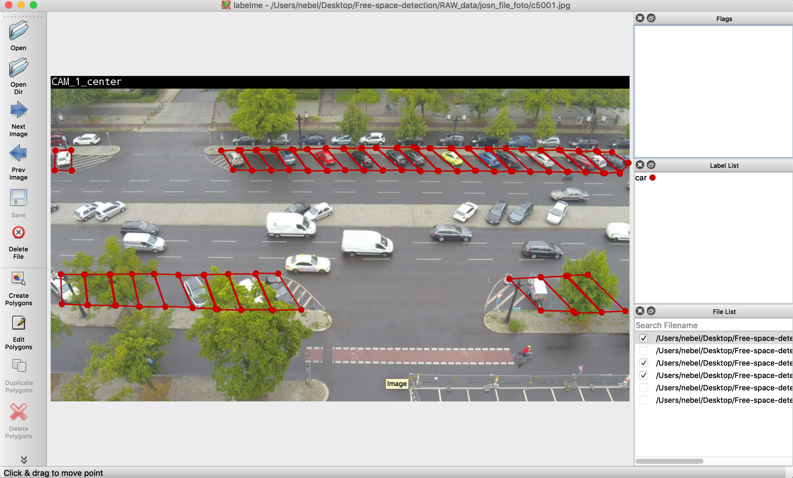
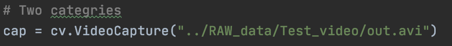
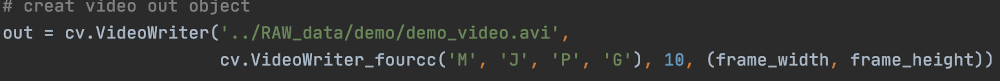
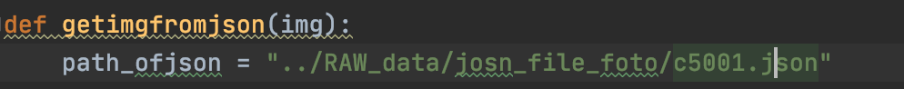
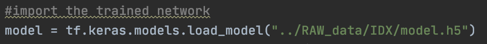

# Freespace-detection-with-kmeans
Use K-Means and shallow neural Network to do Free-space-detection 
## Environment
In File [Coda_Environment](https://github.com/JINGJAN/Freespace-detection-with-kmeans/tree/master/Free-space-detection/Coda_Environment) you can find two coda enviroenment files
### For Mac
[Spec-list.txt](https://github.com/JINGJAN/Freespace-detection-with-kmeans/blob/master/Free-space-detection/Coda_Environment/spec-list.txt):
Use ```conda create  --name python-course --file spec-list.txt``` 
### For other platforms
[Environment.yml](https://github.com/JINGJAN/Freespace-detection-with-kmeans/blob/master/Free-space-detection/Coda_Environment/environment.yml):
Use ```conda env create -f environment.yml```
## Generator Video from pictures
For generate videos i use renamed picture:[Images](https://github.com/JINGJAN/Freespace-detection-with-kmeans/tree/master/Free-space-detection/RAW_data/images)
and [Image2video.py](https://github.com/JINGJAN/Freespace-detection-with-kmeans/blob/master/Free-space-detection/Utilities/img2video.py) python file.
## Use Labelme to generate a josn file

You can download labelme here: [labelme](https://github.com/wkentaro/labelme)
## How to run the code
1. Make sure your have install all the package we need.
2. Parpare the material,the videos of camera.
3. Run the main.py.
### Remind
Set input video path\
\
Set output video path: [Demo](https://github.com/JINGJAN/Freespace-detection-with-kmeans/blob/master/Free-space-detection/RAW_data/demo/out_test.avi)\
\
Use josn file to get prak space with line: [Josn](https://github.com/JINGJAN/Freespace-detection-with-kmeans/blob/master/Free-space-detection/RAW_data/josn_file_foto/c5001.json)\
\
Get Neural Network structure from: [model.h5](https://github.com/JINGJAN/Freespace-detection-with-kmeans/blob/master/Free-space-detection/RAW_data/IDX/model.h5)\
\
